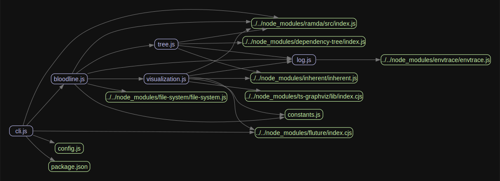

# bloodline

This is a rework of [madge](https://github.com/pahen/madge) so that I can better understand how it works and possibly improve upon it.

### madge example output

### bloodline example output

