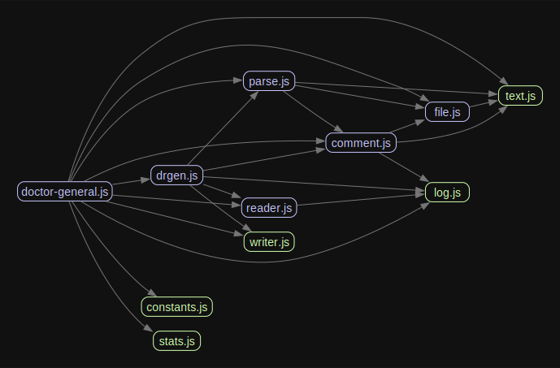

# doctor-general 

## Challenge

Keeping documentation up to date is hard. Keeping valid documentation is hard.

## Summary

`doctor-general` automatically generates documentation (and tests!) based on `jsdoc` style comments.

This is decribed in much [greater detail here](https://brekk.github.io/monoculture/doctor-general).

### Basic Example

 1. Documentation Mode - Read a root package.json and automatically generate MDX files in `apps/docs/pages`

    ```sh
    drgen --monorepo --input ./package.json --output apps/docs/pages
    ```

 1. Test Mode - Read three files and automatically generate tests in `autotests`
    ```sh
    drgen --test-mode --input file.js file2.js file3.js --output autotests
    ```

## Readiness

### Version: Unpublished

This tool is being actively developed. It is in use within this codebase in several locations, but it is currently unpublished.

## Usage

Primarily this module is a library. There is a downstream CLI tool, defined in [doctor-general-cli](../../tools/doctor-general-cli), which is leveraged in a few locations within this monorepo.

We use it to automatically generate tests in:

 1. `climate`
 1. `digested
 1. `inherent`
 1. `knot`
 1. `monorail`
 1. `water-wheel`

And we use it to automatically generate documentation in `apps/docs` (this is publically accessible [here](https://brekk.github.io/monoculture).

## Dependencies



Currently we are loosely tied to using `next` and `jest` but that's more from not having more targets to build against than any specific choices. This could be made easier by extricating and segmenting the current offerings (markdown + jest) into new packages and making the whole thing more modular.
