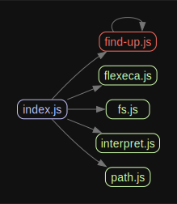

# kiddo

Futures are great alternatives to Promises as lazy, composable and well-modeled asynchrony.

`kiddo` contains some common utility wrappers for `execa`, providing a Future-based interface for interacting with child processes.

