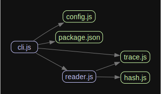

# monocle

`monocle` is a tool for providing a means of introspection of files (especially code). You may already be familiar with Abstract Syntax Tree tools such as `eslint`, `jscodeshift`, `tscodeshift` or similar. These are very powerful means of traversing code syntactically. They allow you to fully engage with JS at a very fundamental and powerful level.

`monocle` is not this. It is designed instead to cater to file traversal and introspection using regular JavaScript. It leverages a plugin system that is built atop [monorail](https://github.com/brekk/monoculture/tree/main/packages/monorail).

It is very much a work-in-progress tool, and leverages many other packages in this monorepo.

`monocle` is designed to pair with `manacle`, a forthcoming package which acts downstream of this tools' output.

`monocle`'s basic process:

 1. Take glob(s) of files + folders
 2. Take configurable, topologically-sorted plugins which derive information from those globs
 3. Populate an object of context based on the that derived information
 4. Produce a `monocle-findings.json` file

`manacle`'s basic process:

 1. Take a `monocle-findings.json` file
 2. Take configurable, topologically-sorted rules which can pass judgement on the information in the findings
 3. Provide a means of enforcing process based on the judgements passed
