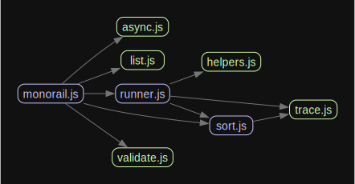

# monorail

This package is designed to provide tooling which helps provide plugin-style architecture. It is currently primarily used by [monocle](https://github.com/brekk/monoculture/tree/main/packages/monocle).
