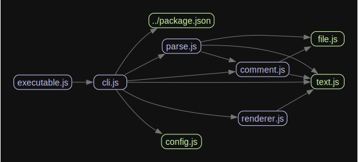

# monodoc

`monodoc` automatically generates documentation based on `jsdoc` style comments.

It is used in this codebase to automatically generate the contents of `apps/docs`, but it is designed to be generic enough for use in any codebase.
